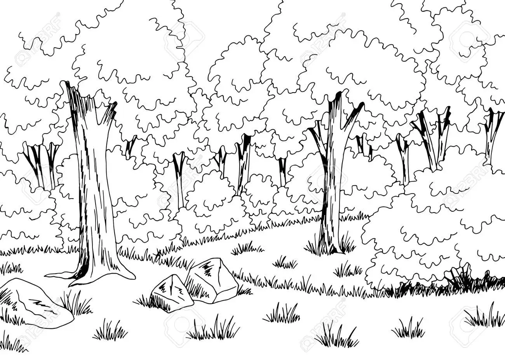
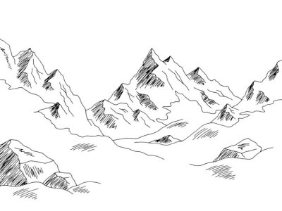

# Mapesche

Filter demos: 

<table style="width: 70%; margin: auto;">
<thead>
    <tr>
      <th>Titre</th>
      <th>Demo</th>
      <th>tags</th>
    </tr>
</thead>
<tbody>

  

</tbody>
</table>

  

    
  

  

     &nbsp;
  

  

    
  

